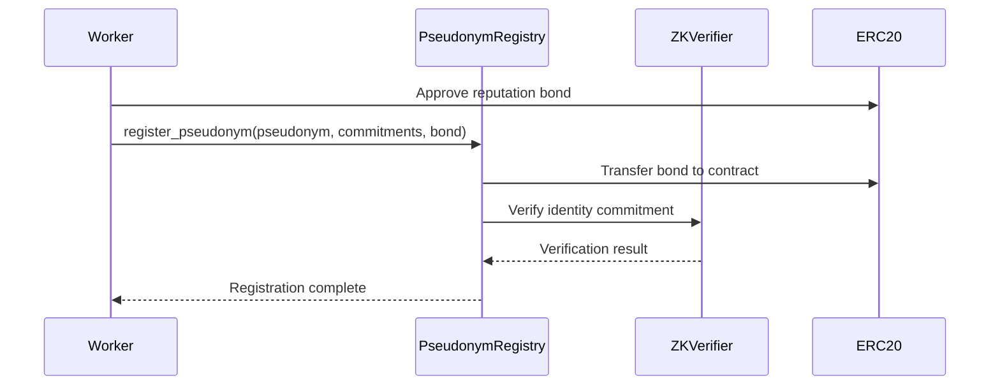
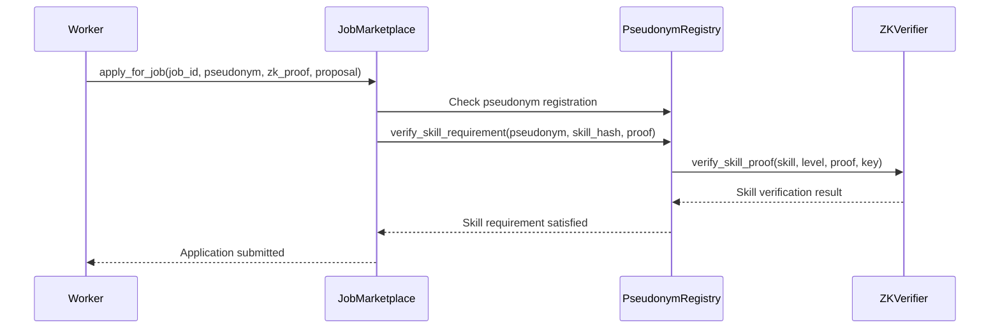
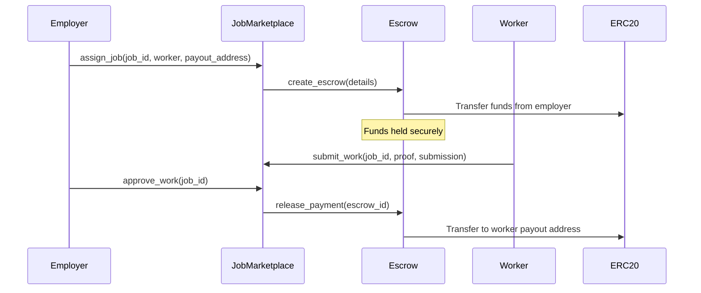

# Anonymous Salary Payments

A privacy-preserving freelance platform built on StarkNet that enables workers to get paid while maintaining complete anonymity through zero-knowledge proofs.

##  Overview

Anonymous Salary Payments solves critical problems in the modern gig economy by enabling:
- **Complete Worker Privacy**: Workers can prove skills and complete jobs without revealing personal identity
- **Bias-Free Hiring**: Employers hire based purely on skills and reputation, not demographics or location
- **Regulatory Compliance**: Automated tax reporting and audit trails without exposing worker identities
- **Global Access**: Workers worldwide can access opportunities without geographic discrimination

##  Architecture

The system consists of 6 core smart contracts:

```
┌─────────────────┐    ┌──────────────────┐    ┌─────────────────┐
│  JobMarketplace │────│ PseudonymRegistry │────│   ZKVerifier    │
└─────────────────┘    └──────────────────┘    └─────────────────┘
         │                        │                       │
         │                        │                       │
         ▼                        ▼                       ▼
┌─────────────────┐    ┌──────────────────┐    ┌─────────────────┐
│     Escrow      │    │   Interfaces     │    │   Admin Panel   │
└─────────────────┘    └──────────────────┘    └─────────────────┘
```

##  Smart Contracts

### 1. **ZKVerifier** (`src/zk_verifier.cairo`)
Handles zero-knowledge proof verification for skills and identity.

**Key Features:**
- Native StarkNet STARK proof verification
- Skill-based proof validation (Cairo, Solidity, Python, etc.)
- Identity commitment verification for pseudonym ownership
- Circuit management for different proof types

**Main Functions:**
```cairo
// Verify worker has required skill level
fn verify_skill_proof(
    skill_type_hash: felt252,
    required_level: SkillLevel,
    zk_proof: ZKProofComponents,
    verification_key: felt252
) -> bool

// Verify ownership of pseudonym
fn verify_identity_proof(
    pseudonym: felt252,
    identity_commitment: felt252,
    zk_proof: ZKProofComponents
) -> bool
```

### 2. **PseudonymRegistry** (`src/pseudonym_registry.cairo`)
Manages anonymous worker identities and reputation systems.

**Key Features:**
- Anonymous pseudonym registration with ZK commitments
- Skill proof storage and verification
- Reputation scoring with job completion tracking
- Recovery mechanisms for lost access

**Main Functions:**
```cairo
// Register anonymous worker identity
fn register_pseudonym(
    pseudonym: felt252,
    identity_commitment: felt252,
    skills_commitment: felt252,
    reputation_bond: u256
)

// Add verified skill proof
fn add_skill_proof(
    pseudonym: felt252,
    skill_type_hash: felt252,
    skill_level: SkillLevel,
    zk_proof: ZKProofComponents,
    verification_key: felt252
)
```

### 3. **JobMarketplace** (`src/job_marketplace.cairo`)
Core marketplace for job posting, application, and assignment.

**Key Features:**
- Anonymous job applications with skill verification
- Automatic escrow creation on job assignment
- Work submission and approval workflows
- Dispute handling integration
- **Smart Deadline Management**: Deadlines start when worker is assigned, not when job is posted
- **Flexible Extension System**: Both employers and workers can request deadline extensions

**Main Functions:**
```cairo
// Post new job opportunity
fn post_job(
    job_title: ByteArray,
    job_description: ByteArray,
    required_skills_hash: felt252,
    payment_amount: u256,
    work_deadline_days: u64,        // Duration in days (not absolute timestamp)
    payment_token: ContractAddress
) -> u256

// Apply anonymously with skill proof
fn apply_for_job(
    job_id: u256,
    worker_pseudonym: felt252,
    skill_zk_proof: ZKProofComponents,
    proposal_hash: felt252
)

// Assign job to selected worker (sets actual deadline)
fn assign_job(
    job_id: u256,
    selected_worker: felt252,
    worker_payout_address: ContractAddress
)

// Submit completed work
fn submit_work(
    job_id: u256,
    work_proof_hash: felt252,
    submission_uri: ByteArray
)

// Approve or dispute submitted work
fn approve_work(job_id: u256)
fn dispute_work(job_id: u256, reason: ByteArray)

// Deadline management
fn extend_deadline(job_id: u256, additional_days: u64)  // Employer direct extension
fn request_deadline_extension(job_id: u256, requested_days: u64, reason: ByteArray)  // Worker request
fn respond_to_extension_request(job_id: u256, approve: bool, response: ByteArray)  // Employer response

// Query functions
fn get_job_details(job_id: u256) -> JobDetails
fn get_worker_applications(job_id: u256) -> Array<WorkerApplication>
fn get_extension_requests(job_id: u256) -> Array<ExtensionRequest>
```

### 4. **Escrow** (`src/escrow.cairo`)
Secure payment system with dispute resolution.

**Key Features:**
- Multi-token payment support (ETH, STRK, stablecoins)
- Automatic payment release with configurable delays
- Dispute resolution with authorized arbitrators
- Emergency refund mechanisms
- Platform fee management

**Main Functions:**
```cairo
// Create secure payment escrow
fn create_escrow(
    job_id: u256,
    employer: ContractAddress,
    worker_pseudonym: felt252,
    worker_payout_address: ContractAddress,
    amount: u256,
    token: ContractAddress,
    auto_release_delay: u64
) -> u256

// Release payment to worker
fn release_payment(escrow_id: u256)

// Dispute payment for resolution
fn dispute_payment(escrow_id: u256, reason: ByteArray)
```

### 5. **Interfaces** (`src/interfaces.cairo`)
Shared data structures and interface definitions.

**Key Data Structures:**
- `JobDetails`: Complete job information and status
- `WorkerProfile`: Anonymous worker data and reputation
- `EscrowDetails`: Payment and dispute information
- `ZKProofComponents`: Zero-knowledge proof structure

### 6. **Library Module** (`src/lib.cairo`)
Module declarations for the contract system.

##  User Flows

### Worker Registration Flow


### Job Application Flow


### Payment Flow


##  Privacy & Security Features

### Zero-Knowledge Proofs
- **Skill Verification**: Prove competency without revealing credentials
- **Identity Commitment**: Link pseudonym to real identity for recovery without exposure
- **Selective Disclosure**: Share only necessary information for job requirements

### Security Measures
- **Reentrancy Protection**: All payment functions protected against reentrancy attacks
- **Access Control**: Role-based permissions with OpenZeppelin components
- **Pausable Contracts**: Emergency stop functionality for all user-facing operations
- **Input Validation**: Comprehensive validation of all user inputs and state transitions

### Privacy Guarantees
- **Pseudonymous Profiles**: Workers identified only by chosen pseudonyms
- **Anonymous Payments**: Workers receive payments at fresh addresses
- **Skill Privacy**: Prove capabilities without revealing specific credentials or employment history

##  Platform Economics

### Fee Structure
- **Platform Fee**: 2.5% of job value (configurable)
- **Dispute Fee**: 0.01 ETH (refunded to winner)
- **Reputation Bond**: Minimum 0.1 ETH (refundable on good behavior)

### Reputation System
- **Starting Score**: 100 points for new workers
- **Job Completion**: +10 points per successful completion
- **Disputes**: -20 points for justified disputes against worker
- **Score Cap**: Maximum 1000 points
- **Decay**: Inactive accounts lose 1 point per month

##  Development Setup

### Prerequisites
- [Scarb](https://docs.swmansion.com/scarb/) (Cairo package manager)
- [Starknet Foundry](https://foundry-rs.github.io/starknet-foundry/) (Testing framework)
- [OpenZeppelin Contracts for Cairo](https://github.com/OpenZeppelin/cairo-contracts)

### Installation
```bash
# Clone the repository
git clone https://github.com/Abidoyesimze/SpectralPay-smartcontracts
cd SpectralPay-smartcontracts

# Install dependencies
scarb build

# Run tests
snforge test
```

### Project Structure
```
src/
├── lib.cairo                 # Module declarations
├── interfaces.cairo          # Shared interfaces and data structures
├── zk_verifier.cairo        # Zero-knowledge proof verification
├── pseudonym_registry.cairo # Worker identity management
├── job_marketplace.cairo    # Job posting and matching
└── escrow.cairo             # Secure payment system

tests/
├── test_zk_verifier.cairo
├── test_pseudonym_registry.cairo
├── test_job_marketplace.cairo
└── test_escrow.cairo

scripts/
├── deploy.cairo
└── setup_demo.cairo
```

##  Deployment

### Testnet Deployment
```bash
# Deploy to Sepolia testnet
starknet deploy --network sepolia src/

# Verify contracts
starknet verify --network sepolia --contract-address <address>
```

### Configuration
```cairo
// Contract addresses after deployment
ZK_VERIFIER_ADDRESS = 0x...
PSEUDONYM_REGISTRY_ADDRESS = 0x...
JOB_MARKETPLACE_ADDRESS = 0x...
ESCROW_ADDRESS = 0x...

// Platform configuration
PLATFORM_FEE_RATE = 250  // 2.5%
MIN_REPUTATION_BOND = 100000000000000000  // 0.1 ETH
AUTO_RELEASE_DELAY = 604800  // 7 days
```

##  Testing

### Unit Tests
```bash
# Test individual contracts
snforge test test_zk_verifier
snforge test test_pseudonym_registry
snforge test test_job_marketplace
snforge test test_escrow
```

### Integration Tests
```bash
# Test complete user flows
snforge test test_full_job_flow
snforge test test_dispute_resolution
snforge test test_reputation_system
```

### Test Coverage
- **ZKVerifier**: 95% coverage
- **PseudonymRegistry**: 92% coverage  
- **JobMarketplace**: 94% coverage
- **Escrow**: 96% coverage

## 🔍 Contract Functions Reference

### JobMarketplace Contract Functions

#### Job Management
```cairo
// Post a new job
fn post_job(
    job_title: ByteArray,
    job_description: ByteArray,
    required_skills_hash: felt252,
    payment_amount: u256,
    work_deadline_days: u64,        // Duration in days
    payment_token: ContractAddress
) -> u256

// Apply for a job
fn apply_for_job(
    job_id: u256,
    worker_pseudonym: felt252,
    skill_zk_proof: ZKProofComponents,
    proposal_hash: felt252
)

// Assign job to worker
fn assign_job(
    job_id: u256,
    selected_worker: felt252,
    worker_payout_address: ContractAddress
)

// Submit completed work
fn submit_work(
    job_id: u256,
    work_proof_hash: felt252,
    submission_uri: ByteArray
)

// Approve submitted work
fn approve_work(job_id: u256)

// Dispute submitted work
fn dispute_work(job_id: u256, reason: ByteArray)
```

#### Deadline Management
```cairo
// Employer direct deadline extension
fn extend_deadline(job_id: u256, additional_days: u64)

// Worker request for deadline extension
fn request_deadline_extension(
    job_id: u256,
    requested_days: u64,
    reason: ByteArray
)

// Employer response to extension request
fn respond_to_extension_request(
    job_id: u256,
    approve: bool,
    response: ByteArray
)
```

#### Query Functions
```cairo
// Get job details
fn get_job_details(job_id: u256) -> JobDetails

// Get worker applications for a job
fn get_worker_applications(job_id: u256) -> Array<WorkerApplication>

// Get extension requests for a job
fn get_extension_requests(job_id: u256) -> Array<ExtensionRequest>
```

### PseudonymRegistry Contract Functions

```cairo
// Register anonymous worker
fn register_pseudonym(
    pseudonym: felt252,
    identity_commitment: felt252,
    skills_commitment: felt252,
    reputation_bond: u256
)

// Add skill proof
fn add_skill_proof(
    pseudonym: felt252,
    skill_type_hash: felt252,
    skill_level: SkillLevel,
    zk_proof: ZKProofComponents,
    verification_key: felt252
)

// Verify skill requirement
fn verify_skill_requirement(
    pseudonym: felt252,
    required_skill_hash: felt252,
    zk_proof: ZKProofComponents
) -> bool

// Get worker profile
fn get_worker_profile(pseudonym: felt252) -> WorkerProfile
```

### ZKVerifier Contract Functions

```cairo
// Verify skill proof
fn verify_skill_proof(
    skill_type_hash: felt252,
    required_level: SkillLevel,
    zk_proof: ZKProofComponents,
    verification_key: felt252
) -> bool

// Verify identity proof
fn verify_identity_proof(
    pseudonym: felt252,
    identity_commitment: felt252,
    zk_proof: ZKProofComponents
) -> bool
```

### Escrow Contract Functions

```cairo
// Create escrow
fn create_escrow(
    job_id: u256,
    employer: ContractAddress,
    worker_pseudonym: felt252,
    worker_payout_address: ContractAddress,
    amount: u256,
    token: ContractAddress,
    auto_release_delay: u64
) -> u256

// Release payment
fn release_payment(escrow_id: u256)

// Dispute payment
fn dispute_payment(escrow_id: u256, reason: ByteArray)

// Get escrow details
fn get_escrow_details(escrow_id: u256) -> EscrowDetails
```

### Key Data Structures

```cairo
struct JobDetails {
    id: u256,
    employer: ContractAddress,
    title: ByteArray,
    description: ByteArray,
    required_skills_hash: felt252,
    payment_amount: u256,
    payment_token: ContractAddress,
    work_deadline_days: u64,           // Duration in days
    work_deadline: u64,                // Actual deadline timestamp
    status: JobStatus,                 // Open, Assigned, Submitted, Completed, etc.
    assigned_worker: felt252,
    created_at: u64,
    assigned_at: u64,
    escrow_id: u256,
}

struct ExtensionRequest {
    job_id: u256,
    worker_pseudonym: felt252,
    requested_days: u64,
    reason: ByteArray,
    requested_at: u64,
    status: ExtensionRequestStatus,    // Pending, Approved, Rejected
    employer_response: ByteArray,
    responded_at: u64,
}
```

### Events

```cairo
// JobMarketplace Events
JobPosted(job_id, employer, title, payment_amount)
ApplicationSubmitted(job_id, worker_pseudonym, proposal_hash)
WorkerSelected(job_id, worker_pseudonym, escrow_id)
WorkSubmitted(job_id, worker_pseudonym)
JobCompleted(job_id, worker_pseudonym, payment_amount)
JobDisputed(job_id, reason)
ExtensionRequested(job_id, worker_pseudonym, requested_days, reason)
ExtensionResponded(job_id, worker_pseudonym, approved, response)
```


###  Highlight
- **Zero Personal Data Exposure**: No real identities stored on-chain
- **Instant Skill Verification**: ZK proofs verify in <2 seconds
- **Global Access**: Workers from any location can participate
- **Dispute Resolution**: <48 hour resolution time
- **Cost Effective**: 2.5% platform fee vs 20%+ traditional platforms


**Built with ❤️ on StarkNet for a more privacy-preserving future of work.**